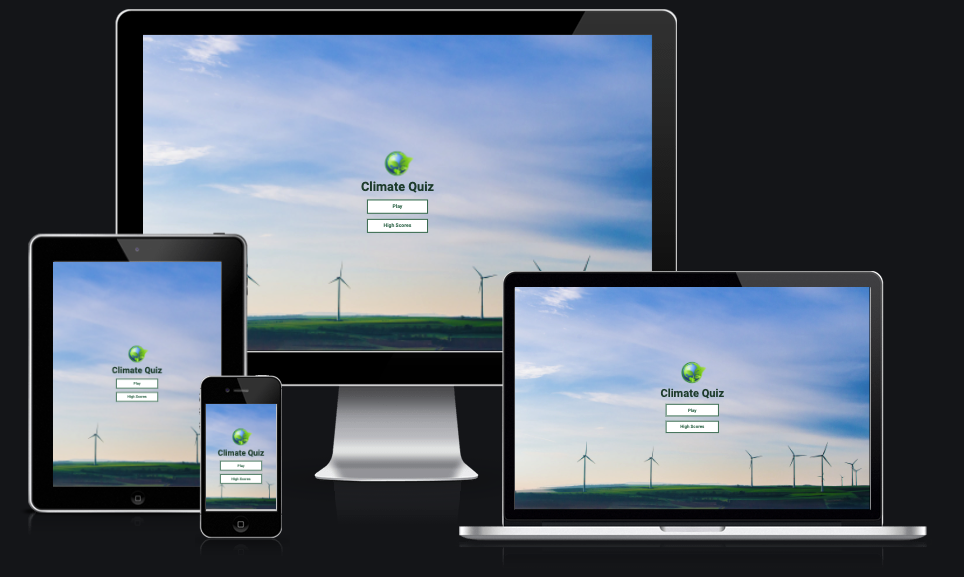
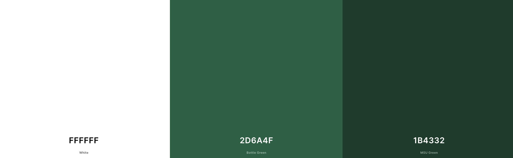
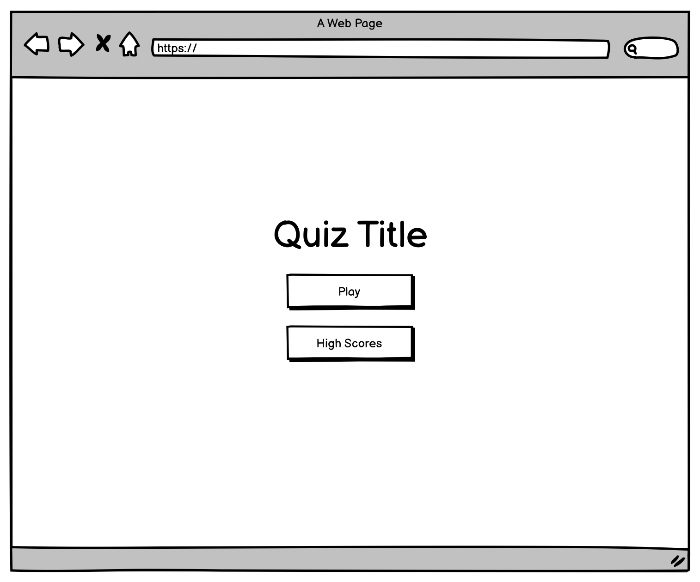
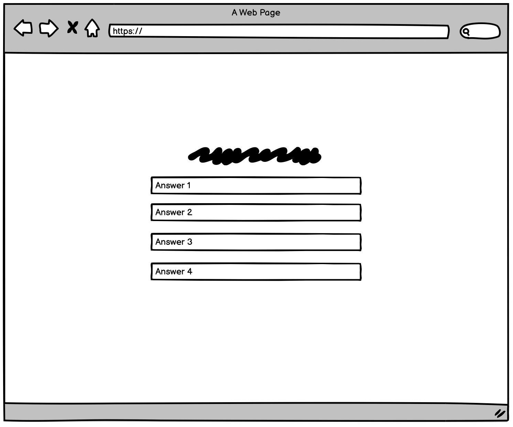
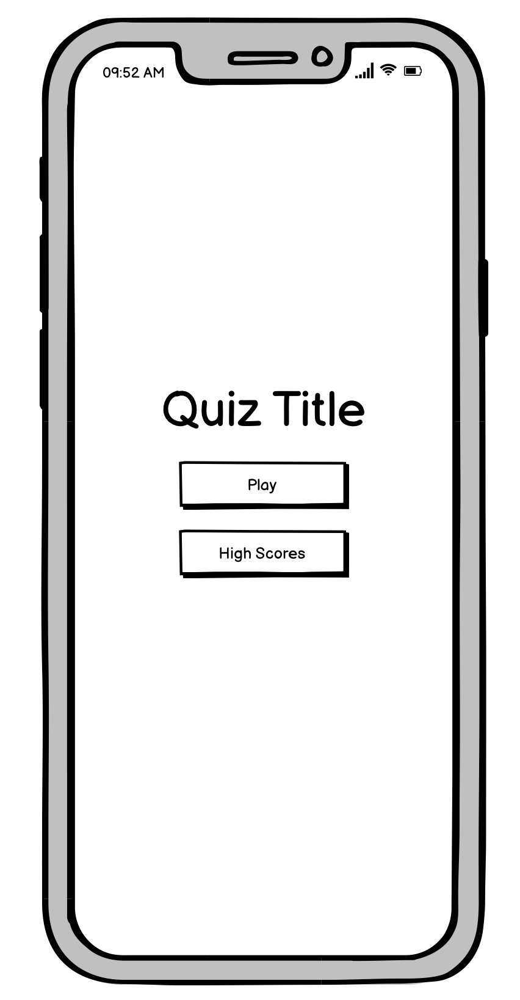
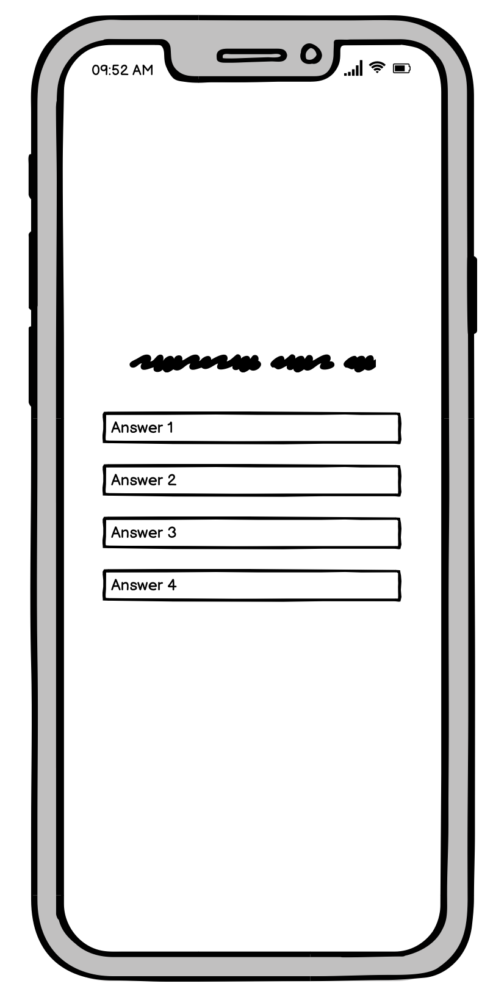
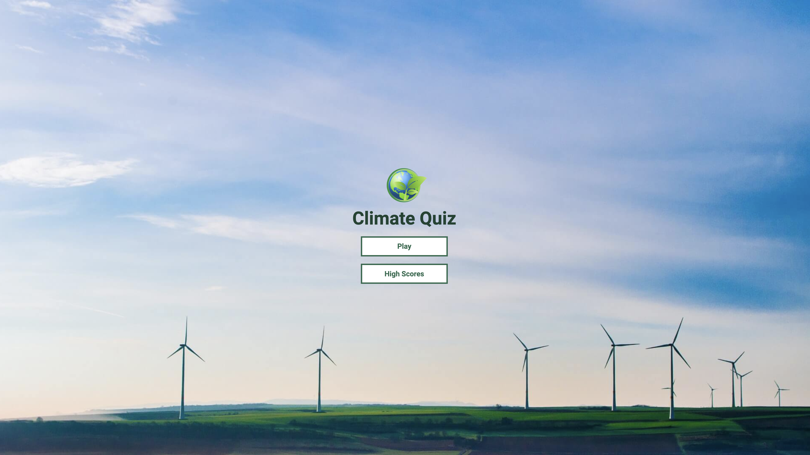
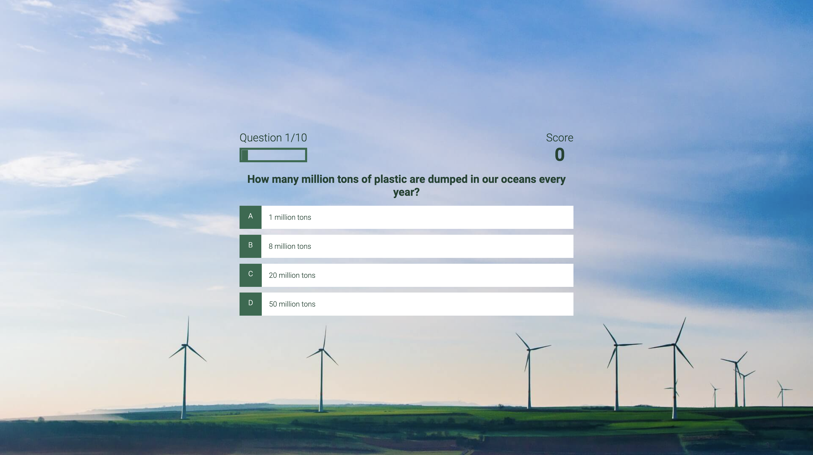
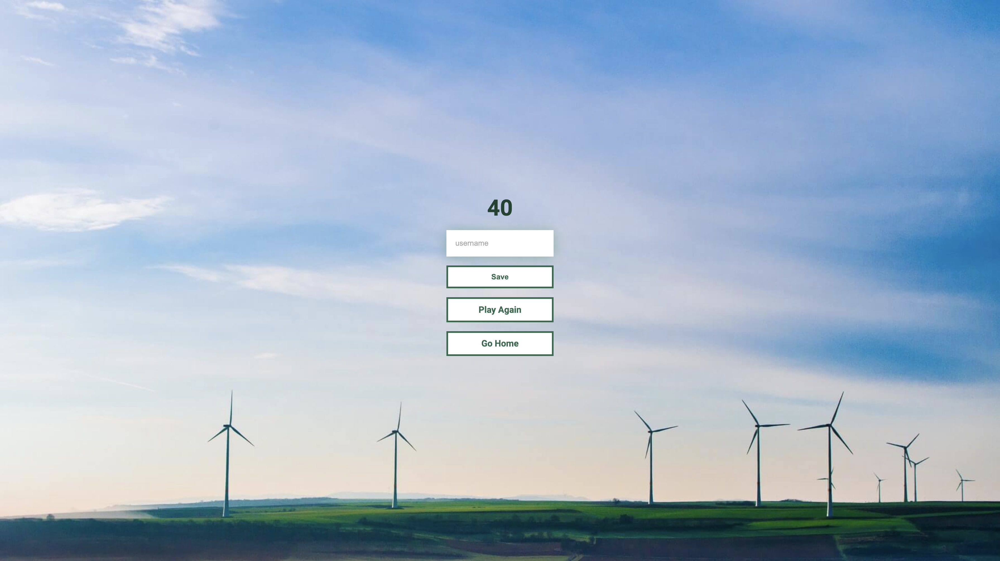
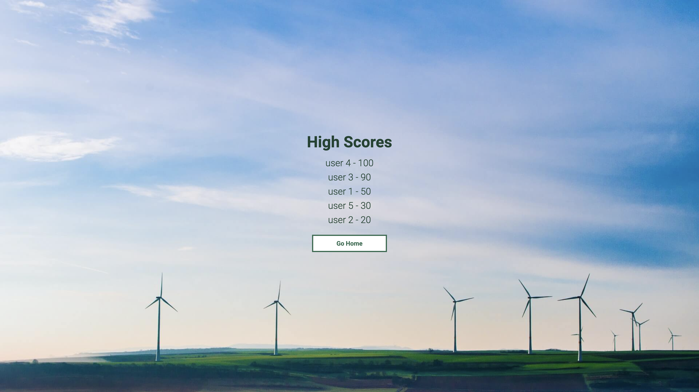

# Climate Quiz
Climate quiz is an interactive quiz game where players can test their climat and environmental knowledge. The game consists of 10 questions. If a player answer a question currectly they will receive 10 bonus points. Upon completing the game, the user can save their high score and later look back on the top high scores for the game. This game is not only fun for users to play but also allows users to learn important facts about climate change and the environment. 

# Target Audience 
- People who enjoy their knowlede being tested
- People who are climate conscious
- People who enjoy quiz games
- People who enjoy learning facts

# Design Choices
## Colour Pallette
I chose to ge for a very minimal colour palette. To complement the theme of the game which focused on climate and environmental facts, I chose to use different tones of green. The colour palette I generated is available at https://coolors.co/ffffff-2d6a4f-1b4332

## Typography
- 1 main font was used for the site 
- Font was sourced from Google Fonts
- Font used Roboto, sans-serif
- The font was chosen as it was simple and easy to read

## Wireframe
I designed wireframes for desktop and mobile viewing. The wireframes were simplistic to visualise how I wanted the questions to be displayed. I created wireframes for the game start page and questions page.

### Desktop

### Mobile

# Features

## Start Page
The start page showcases the game title along with the logo. The logo was created using canva. Underneat the headng and logo are two buttons that offers the players the choice to either start the game or have a look at the top high scores.

## Game Page
The game page shows a question and gives the player 4 answer choices to choose from. If a user gets a question wrong the chose answer choice turns red and if the user gets a question right the chosen answer choice turns green. Every time a user gets a correct answer they get 10 points. The points are shown at the top right hand side. Opposite the points on the left hand side the user can see how many questions they have answered out of the total questions available.

## End Page
Once the user has answered all the question they are taken to the end page which show them their score and gives them the option to save their score by inserting their username and clicking the save button. If a user dows not insert a username they cannot click the save button. Once the score is saved they are taken back to the home page. Under the Save button on the end screen are two more buttons that will either allow the user to play the game again or go to the home page. 

## High Scores Page
The high scores page lists the top scores for the game. The list is limited to showing only the top 5 hight scores.

# Testing
To ensure cross-compatability, I tested the website across numerous devices and web browsers. The site was tested across different iPhones, a samsung galaxy fold, an iPad, a Mac laptop, and a hp laptop. The site was also tested across google Chrome, Safari and Edge. For responsiveness I used the developer tool for screen adjustments, so I could see how the site would look on different screen sizes as I made the required adjustments for it to be completely responsive.

## Testing Method

## Responsive Design
I found it easy to adjust the site for responsiveness design as I went for a mobile first approach when styling the site. This made for a smooth transition from small screen to large screen. 

There was a small issue when it game to the medium to large screens. I found when testing that the answer choice boxes in the game kept changing in length as you went trough the questions but didn't happen when playing the game in a small screen size. I found that this was because I had not included a width on the container. One I included the width, the issue was solved and question and answer areas remained consistent across different screen sizes

## Validator Testing
### HTML

### CSS

### Lighthouse
#### Desktop

#### Mobile

# Bugs
## Uncaught TypeError
There was an uncaught type error on the home page, which declared inner text as null. The reason this error was happening was because the item didn't exist in the index HTML page. In order to resolve this I would need to create a seperate Javascript for the home page or simply delete the Javascript source in the index page. As the home page didn't have any javascript functions, I chose to delete the javascript source link, which solved the issue.  

## Question repetition
There was an issue while going through the quiz with the same questions repeating themselves, rather than moving onto new questions. While I put in the correct code to stop questions repeating, the issue was still there. I discovered I had a simple spelling mistake in the code which quickly solved the issue, when corrected.

## Saving High Score
There was an issue when it came to saving the high scores, where instead of saving the most recent score it was saving a random number. This was a result of the wrong code being written. Once I corrected this code the game started saving the correct score instead of a random number. 

# Deployment

# Technology Used
- HTML
- CSS
- Javascript

# Credits

## Contents
- Font was sourced from Google Fonts https://fonts.google.com/

## Support
- - Richard Wells Code Institute Mentor.

## Tutorials
- Javascript Quiz Tutorial - https://www.youtube.com/watch?v=u98ROZjBWy8&t=7s

## Quiz Questions
- https://ig.ft.com/climate-change-quiz/
- https://www.washingtonpost.com/climate-solutions/interactive/2022/climate-change-quiz/
- https://www.energy.gov/maps/quiz-how-much-do-you-know-about-climate-change
- https://www.earthday.org/the-climate-change-quiz/ 
- https://www.earthday.org/plastic-pollution-quiz/

## Media
- Picture was taken from the open source site Unsplash https://unsplash.com/

## Code
- CSS glass effect used on game start page - https://css.glass/
/* From https://css.glass */
background: rgba(255, 255, 255, 0.71);
border-radius: 16px;
box-shadow: 0 4px 30px rgba(0, 0, 0, 0.1);
backdrop-filter: blur(4px);
-webkit-backdrop-filter: blur(4px);
border: 1px solid rgba(255, 255, 255, 0.04);